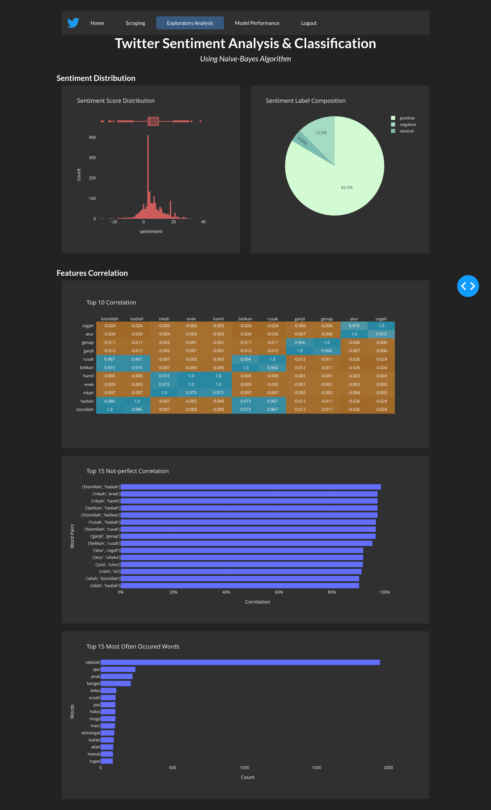

# Lexicon-based Sentiment Analysis on Indonesian-language tweets.

## Introduction
The objective of this project was to create a tool for sentiment analysis of tweets in the Indonesian language, which is there's only limited option of libraries that could preprocess the language quite well, so this project used a customized dictionary to dealt with slangs and non-standard words.

## Method
Naive Bayes classification algorithm and gridsearchCV exhaustive search were used to train the model.

## Results
The model evaluation shows that the model performed quite well, with 88% accuracy. The web app is built on top of Plotly dash and configured to be deployed on the Heroku server.

### Homepage

### Scapping Page

### EDA Page

### MOdel Performance Page
